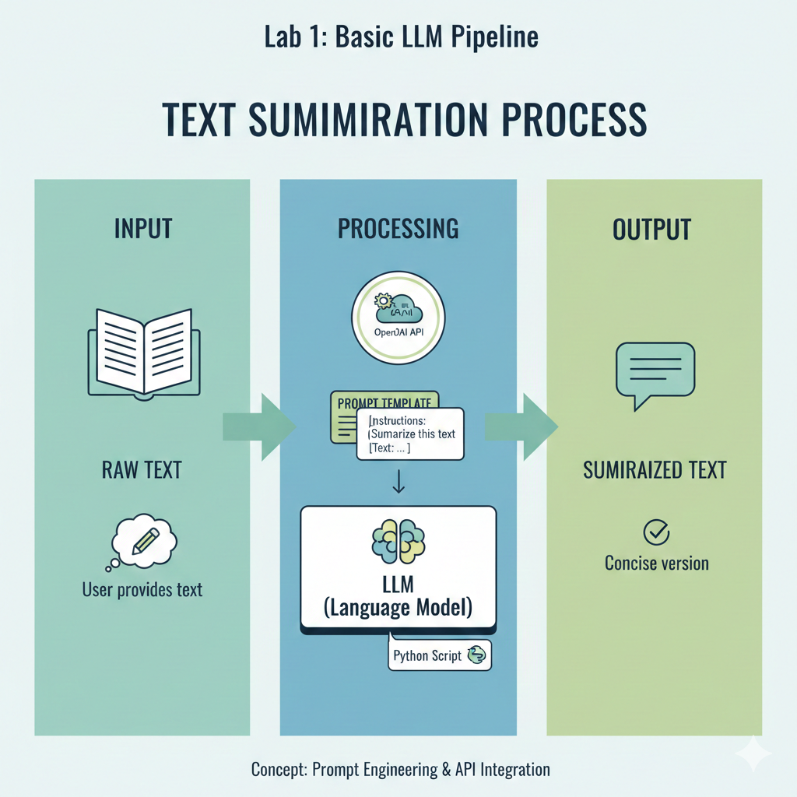
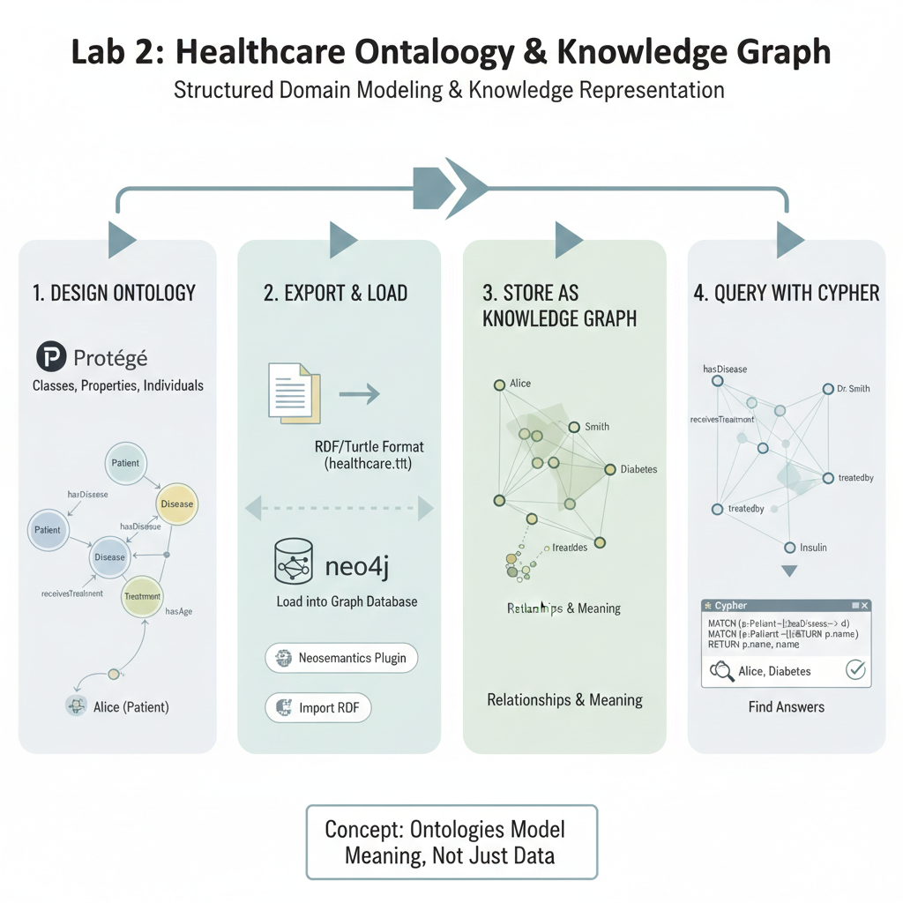
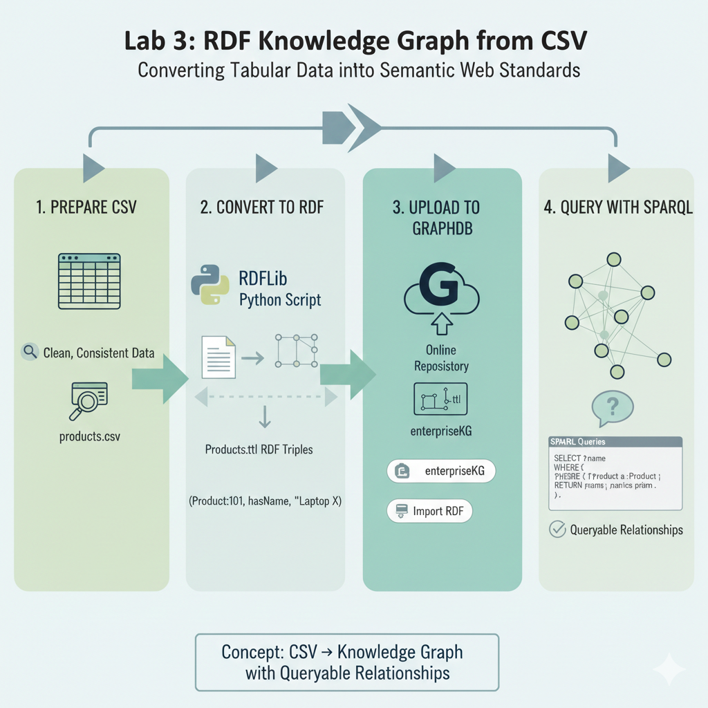
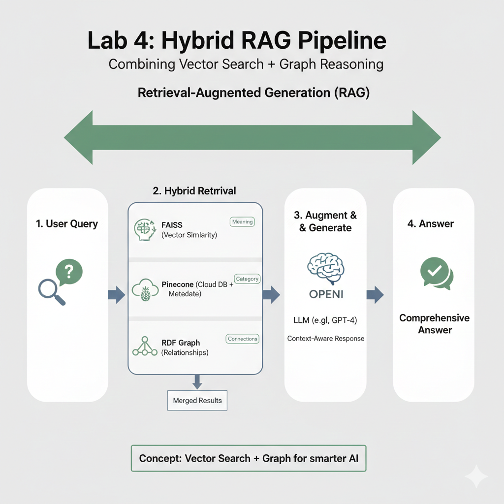
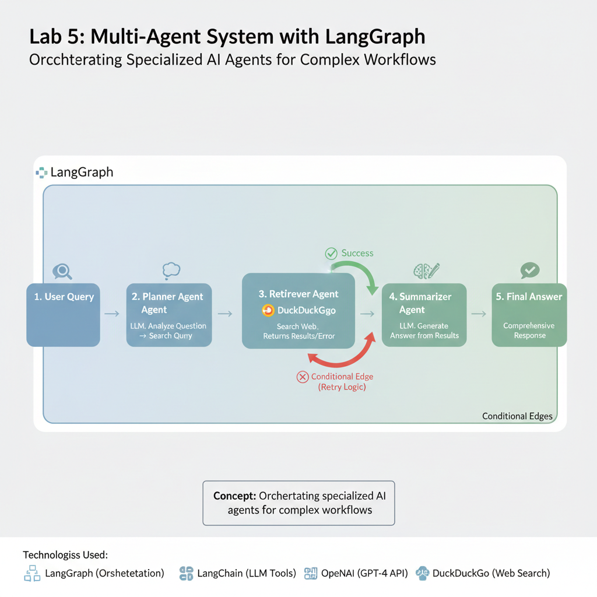
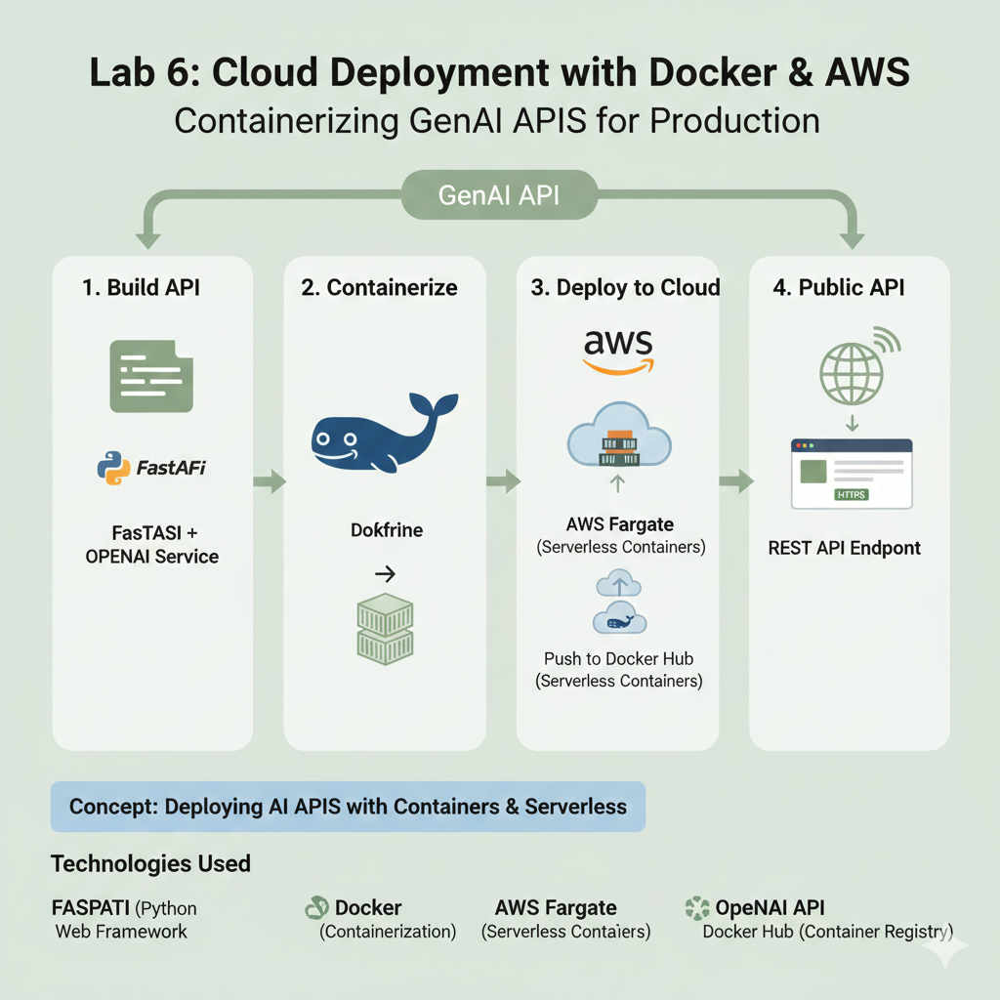
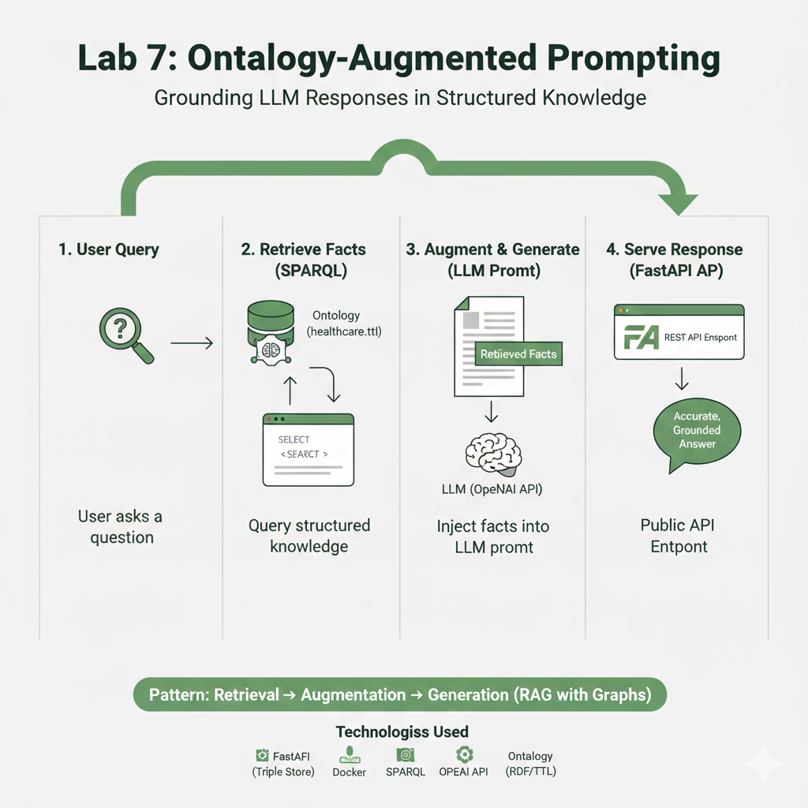
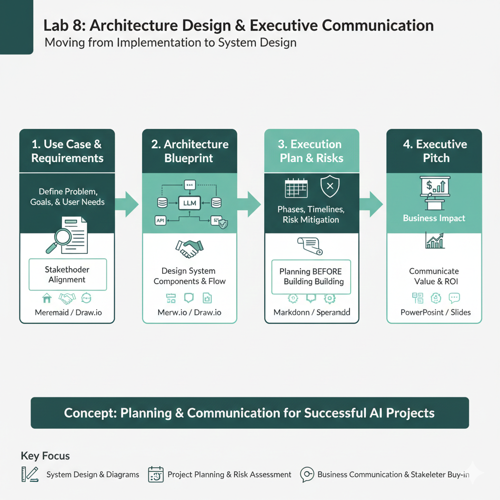
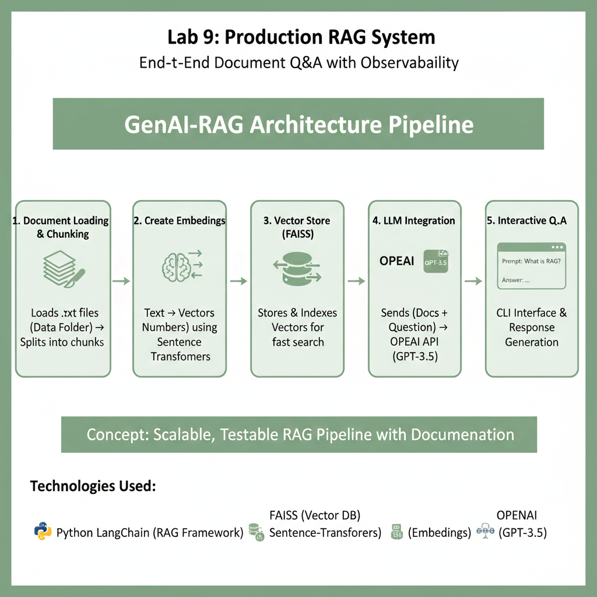
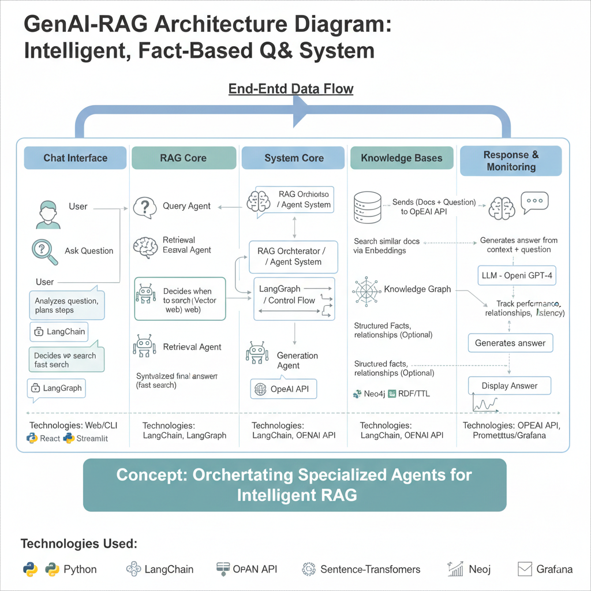

# Generative AI Architect Labs - Personal Learning Journey

> **Important Notice**: This repository contains my hands-on lab implementations and extensions developed while studying the **Udemy Certified Generative AI Architect with Knowledge Graphs** program.  
> The code reflects my personal learning, enhancements, and architectural improvements beyond the original labs. Course materials are not included.

## 📚 Overview

A collection of 9 progressive labs exploring the full stack of Generative AI architecture - from basic LLM pipelines to production-ready cloud deployments with knowledge graphs and multi-agent systems.

**Key Technologies**: Python, OpenAI API, Neo4j, RDF/SPARQL, Docker, AWS, LangGraph, FastAPI, Vector Databases (FAISS, Pinecone)

---

## 🎯 Learning Path

### **Lab 1: Basic LLM Pipeline**

**Concept**: Introduction to prompt engineering and API integration  
Built a simple text summarization pipeline using OpenAI API with custom prompt templates.

---

### **Lab 2: Healthcare Ontology & Knowledge Graph**

**Concept**: Knowledge representation without AI - structured domain modeling  
Created a healthcare ontology in Protégé (Patients, Doctors, Diseases, Treatments) → Exported to RDF/Turtle → Loaded into Neo4j → Queried relationships with Cypher.

**Key Insight**: Ontologies model _meaning_, not just data.

---

### **Lab 3: RDF Knowledge Graph from CSV**

**Concept**: Converting tabular data into semantic web standards  
Transformed a products dataset (100 items) into RDF triples using RDFLib → Uploaded to GraphDB → Queried with SPARQL.

**Outcome**: CSV → Knowledge Graph with queryable relationships.

---

### **Lab 4: Hybrid RAG Pipeline**

**Concept**: Combining vector search + graph reasoning for retrieval  
Implemented **3 retrieval methods**:

- FAISS (local vector similarity)
- Pinecone (cloud vector DB with metadata filtering)
- RDF Graph (structured relationship queries)

Merged results for context-aware LLM responses.

---

### **Lab 5: Multi-Agent System with LangGraph**

**Concept**: Orchestrating specialized AI agents for complex workflows  
Built a 3-agent system:

- **Planner**: Query analysis
- **Retriever**: Web search (DuckDuckGo)
- **Summarizer**: Response generation

Introduced **conditional edges** for retry logic and agent coordination.

---

### **Lab 6: Cloud Deployment with Docker & AWS**

**Concept**: Containerizing GenAI APIs for production  
Created a FastAPI + OpenAI service → Dockerized → Deployed to AWS Fargate (serverless containers) → Exposed as public REST API.

---

### **Lab 7: Ontology-Augmented Prompting**

**Concept**: Grounding LLM responses in structured knowledge  
Built a healthcare assistant that:

1. Queries ontology via SPARQL for validated facts
2. Injects results into LLM prompt
3. Serves responses via FastAPI endpoint

**Pattern**: Retrieval → Augmentation → Generation (RAG with graphs)

---

### **Lab 8: Architecture Design & Executive Communication**

**Concept**: Moving from implementation to system design  
Created full architecture blueprints:

- Use case definition & requirements
- Component diagrams (Mermaid/Draw.io)
- Execution plan with risk assessment
- Executive pitch deck

**Focus**: Planning _before_ building - stakeholder alignment.

---

### **Lab 9: Production RAG System**

**Concept**: End-to-end document Q&A with observability  
Implemented complete RAG architecture:

- Document loading & chunking
- Local embeddings (sentence-transformers)
- FAISS vector store
- OpenAI LLM integration
- Interactive CLI interface

**Deliverable**: Scalable, testable RAG pipeline with full documentation.

---

## 🛠️ Technical Stack Summary

| Layer                | Technologies                               |
| -------------------- | ------------------------------------------ |
| **LLMs**             | OpenAI GPT-3.5/4                           |
| **Knowledge Graphs** | Neo4j, RDF/Turtle, SPARQL, Protégé         |
| **Vector DBs**       | FAISS, Pinecone                            |
| **Orchestration**    | LangGraph, LangChain                       |
| **APIs**             | FastAPI, REST                              |
| **Cloud**            | Docker, AWS Fargate                        |
| **Languages**        | Python (RDFLib, SPARQLWrapper, OpenAI SDK) |

---

## 📖 Key Concepts Mastered

✅ **RAG Patterns**: Vector + Graph hybrid retrieval  
✅ **Semantic Web**: Ontologies, RDF, SPARQL  
✅ **Multi-Agent AI**: Coordinated reasoning systems  
✅ **Production Deployment**: Containerization, serverless cloud APIs  
✅ **System Architecture**: Design docs, stakeholder communication  
✅ **Knowledge Engineering**: Ontology lifecycle & governance

---

## 🎓 Learning Outcomes

This hands-on journey taught me:

1. **LLMs need grounding** - RAG dramatically reduces hallucinations
2. **Graphs unlock reasoning** - Ontologies provide structure LLMs can't learn
3. **Multi-agent > single model** - Specialization improves accuracy
4. **Architecture matters** - Good design enables scalability & maintainability
5. **Cloud-native is essential** - Production AI requires infrastructure thinking

---

## ⚖️ Repository Disclaimer

This repository contains **only personal lab code and documentation**. No course materials, lectures, or proprietary content are included. All implementations were completed independently as learning exercises.

**Course Reference**: Certified Generative AI Architect with Knowledge Graphs (Udemy)
[Link Text](https://www.udemy.com/certificate/UC-71a27862-cedc-4d8d-9ed3-fd0682962c6c/)

---

---

_Last Updated: February 2026_
