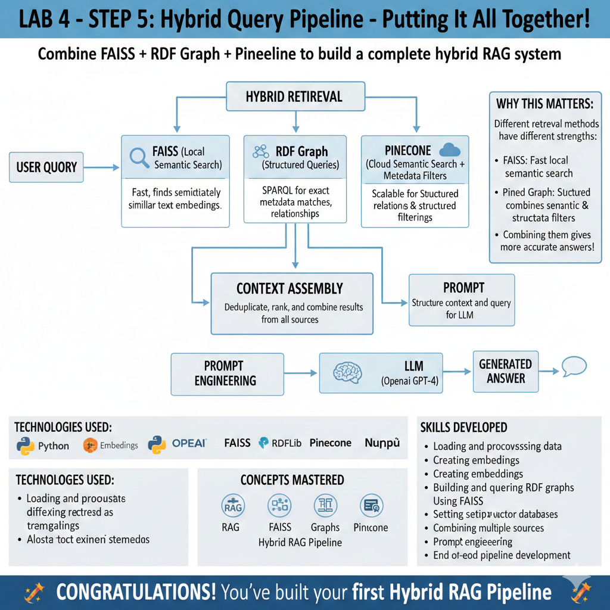

# Lab 4: Hybrid RAG Pipeline

## 🎯 What is this project?

This is a hands-on learning lab to build my first **Retrieval-Augmented Generation (RAG)** pipeline!

### What is RAG?

RAG combines:

- **Retrieval**: Finding relevant information from a knowledge base
- **Augmented**: Adding that information to your prompt
- **Generation**: Using an AI model (like GPT-4) to generate an answer

Think of it like:

- Traditional AI: "Answer this question from what you know"
- RAG: "Here's a textbook chapter, now answer this question"

### Why Hybrid?

We use THREE different retrieval methods:

1. **FAISS** - Fast vector similarity search (finds similar meanings)
2. **Pinecone** - Cloud vector database with metadata filtering (finds by category)
3. **RDF Graph** - Structured data with relationships (finds by connections)

## 🚀 Setup Instructions

### Step 1: Install Python Dependencies

```bash
pip install openai faiss-cpu rdflib pinecone langchain datasets tqdm python-dotenv
```

### Step 2: Get API Keys

1. **OpenAI API Key**:
   - Go to https://platform.openai.com/api-keys
   - Create an account (if needed)
   - Click "Create new secret key"
   - Copy the key

2. **Pinecone API Key**:
   - Go to https://www.pinecone.io/
   - Sign up for free account
   - Go to API Keys section
   - Copy your API key

### Step 3: Configure Environment

1. Copy `.env.template` to `.env`:

   ```bash
   cp .env.template .env
   ```

2. Edit `.env` and add your actual API keys

### Step 4: Run the Lab

Run scripts in order:

1. `python 01_setup_and_data.py` - Load sample data
2. `python 02_build_knowledge_graph.py` - Create RDF graph
3. `python 03_vector_indexing_faiss.py` - Build FAISS index
4. `python 04_setup_pinecone.py` - Upload to Pinecone
5. `python 05_hybrid_query.py` - Run hybrid search!

## 📁 Project Structure

```
lab4_hybrid_RAG_pipeline/
├── README.md                          # This file
├── requirements.txt                   # Python dependencies
├── .env.template                      # API keys template
├── .env                              # Your actual keys (DON'T COMMIT!)
├── data/                             # Generated data files
│   ├── sample_documents.json         # Raw documents
│   └── knowledge.ttl                 # RDF graph file
├── models/                           # Saved models/indexes
│   ├── faiss_index.bin              # FAISS vector index
│   └── embeddings.npy               # Document embeddings
├── 01_setup_and_data.py             # Step 1: Load data
├── 02_build_knowledge_graph.py      # Step 2: Build RDF graph
├── 03_vector_indexing_faiss.py      # Step 3: Create FAISS index
├── 04_setup_pinecone.py             # Step 4: Setup Pinecone
└── 05_hybrid_query.py               # Step 5: Run queries!
```

## 🎓 Learning Path

Each script teaches you a concept:

- **Script 1**: Data loading and preprocessing
- **Script 2**: Graph databases (RDF) and SPARQL queries
- **Script 3**: Vector embeddings and similarity search
- **Script 4**: Cloud vector databases with metadata
- **Script 5**: Combining everything for hybrid RAG!

## ❓ Need Help?

Read the comments in each Python file - they explain every step!


