# GenAI-RAG Architecture Diagram

## System Overview

This RAG (Retrieval-Augmented Generation) system answers questions by:

1. Finding relevant documents from our knowledge base
2. Sending those documents + question to an AI
3. Getting an intelligent, fact-based answer

## Architecture Diagram (Mermaid)

```mermaid
graph TD
    %% User Interface Layer
    User[👤 User] -->|"Ask Question"| UI[🖥️ Chat Interface]

    %% API Gateway Layer
    UI -->|HTTP Request| API[🚪 API Gateway]

    %% RAG Pipeline - The Brain!
    API --> RAG[🧠 RAG Engine]

    %% Retrieval Layer - Finding Relevant Info
    RAG -->|"1. Convert question to vector"| Embed[📊 Embedding Model]
    Embed -->|"2. Search similar docs"| Vector[💾 Vector DB - FAISS]

    %% Knowledge Graph (Optional - Advanced)
    RAG -.->|"Optional: Graph query"| Graph[🕸️ Knowledge Graph]

    %% LLM Layer - The AI Brain
    Vector -->|"3. Top relevant docs"| Context[📚 Context Builder]
    Graph -.->|"Related entities"| Context
    Context -->|"4. Docs + Question"| LLM[🤖 LLM - OpenAI GPT]

    %% Response Layer
    LLM -->|"5. Generated Answer"| Output[📤 Response Formatter]
    Output -->|Display Answer| UI

    %% Monitoring Layer
    RAG -.->|Logs & Metrics| Monitor[📈 Monitoring]
    LLM -.->|Performance Data| Monitor

    %% Styling
    classDef userLayer fill:#e1f5ff,stroke:#01579b
    classDef apiLayer fill:#fff9c4,stroke:#f57f17
    classDef retrievalLayer fill:#f3e5f5,stroke:#4a148c
    classDef llmLayer fill:#e8f5e9,stroke:#1b5e20
    classDef monitorLayer fill:#fce4ec,stroke:#880e4f

    class User,UI userLayer
    class API apiLayer
    class RAG,Embed,Vector,Graph,Context retrievalLayer
    class LLM,Output llmLayer
    class Monitor monitorLayer
```

## Component Descriptions

### 1️⃣ User Interface Layer

- **User**: Person asking questions
- **Chat Interface**: Web or CLI interface for interaction

### 2️⃣ API Gateway

- **Purpose**: Routes requests, handles authentication
- **In our lab**: Simple Python function

### 3️⃣ RAG Engine (The Core!)

- **Embedding Model**: Converts text → numbers (vectors)
- **Vector DB (FAISS)**: Stores and searches document embeddings
- **Context Builder**: Combines retrieved docs with user question

### 4️⃣ LLM Layer

- **OpenAI GPT**: Generates intelligent answers
- **Input**: Question + Retrieved Documents
- **Output**: Natural language answer

### 5️⃣ Optional Components

- **Knowledge Graph**: Structured relationships (we'll skip for now)
- **Monitoring**: Track performance (we'll add simple logging)

## Data Flow Example

**Question**: "What is RAG?"

1. **User types**: "What is RAG?"
2. **Embedding**: Convert question → [0.23, 0.87, -0.45, ...]
3. **Vector Search**: Find top 3 similar documents
4. **Context**: "Here are relevant docs: [doc1, doc2, doc3]"
5. **LLM**: "Based on the docs, RAG is..."
6. **Response**: Display to user

## Tech Stack

- **Language**: Python 3.10+
- **Vector DB**: FAISS (local, free)
- **Embeddings**: sentence-transformers
- **LLM**: OpenAI GPT-3.5/4
- **Framework**: LangChain
